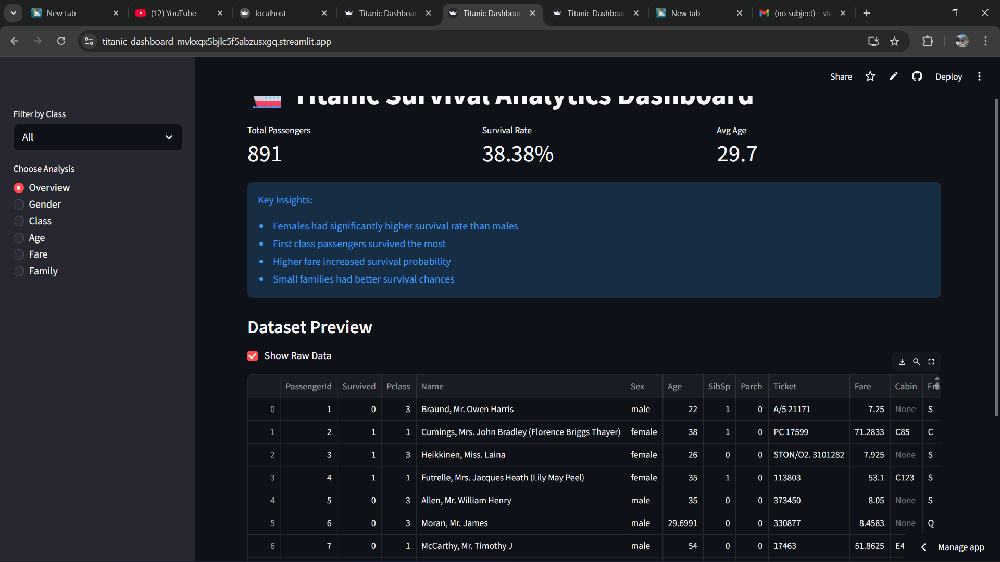
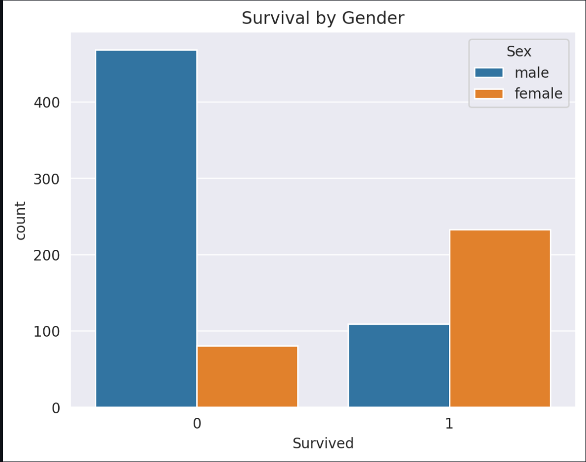
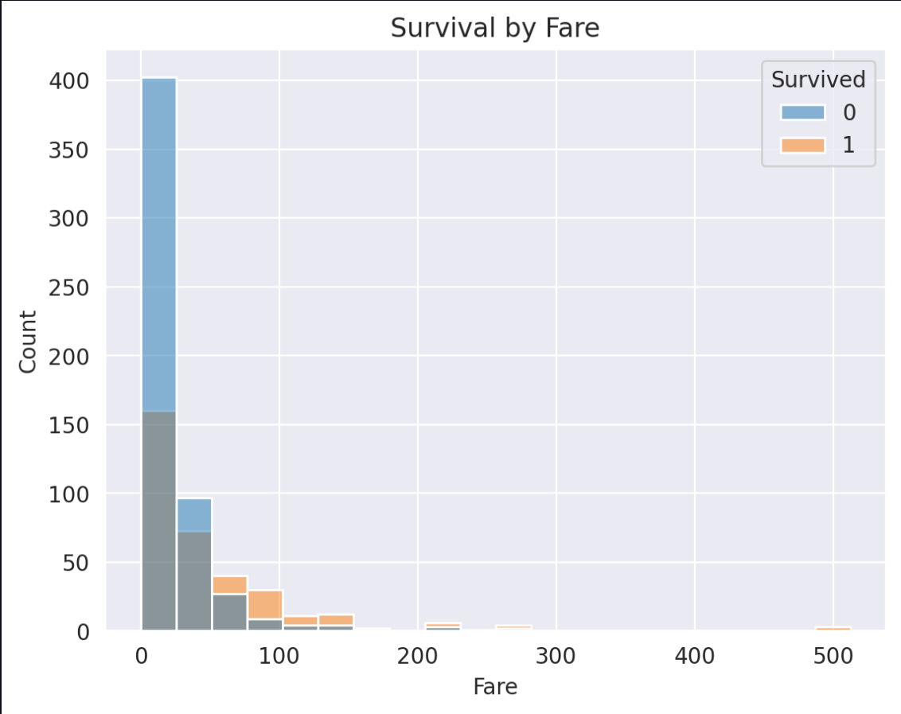

#  Titanic Data Analysis Dashboard

##  Overview
This project is an interactive data analysis dashboard built using **Python, Pandas, Seaborn, and Streamlit**.  
It explores survival patterns in the Titanic dataset through data cleaning, feature engineering, and visualizations.

The dashboard allows users to interactively analyze how different factors such as **gender, class, age, fare, and family size** influenced survival.

---

##  Live Demo
🔗 (https://titanic-dashboard-mvkxqx5bjlc5f5abzusxgq.streamlit.app)

---

## Screenshotsssssss

### Overview


### Gender Analysis


### Fare Analysis


##  Features
-  Data cleaning and preprocessing
-  Feature engineering (Gender, Class, Family Size)
-  Interactive sidebar filters
-  Dynamic visualizations
-  Key insights extraction
-  Fully deployed web application using Streamlit

---

##  Visualizations Included
- Survival by Gender
- Survival by Passenger Class
- Age Distribution
- Fare Distribution
- Survival by Family Size

---

##  Key Insights
- Females had significantly higher survival rates than males  
- First-class passengers had the highest survival probability  
- Higher fare was associated with increased survival chances  
- Smaller families had better survival outcomes  

---

##  Tech Stack
- **Python**
- **Pandas**
- **Matplotlib**
- **Seaborn**
- **Streamlit**

---

##  Dataset
- Titanic dataset (CSV format)

---

##  How to Run Locally

```bash
pip install -r requirements.txt
streamlit run app.py
```
## Author

**Shashwat Singh**  
B-Tech Student | Aspiring Data Analyst | ML Engineer


